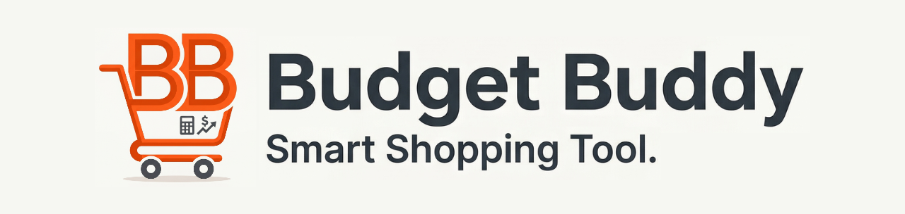

# Budget Buddy Iligan City




**Budget Buddy** is a simple and intuitive web app designed to help users manage their expenses, track their income, and stay on top of their budgets!  
Built with love using **Express.js**, **React.js**, and hosted on **Vercel**. 🧡

---

## Why Did I Make This Project?

With the fluctuating prices of everyday goods, planning a grocery run can be stressful. I built Budget Buddy to solve a simple problem: **knowing exactly what you'll spend before you reach the cashier.** Beyond that, this project serves as a way to give back to the local community in Iligan City while pushing my skills in full-stack web development, secure authentication, and modern UI/UX design.

---

## My Mission

> To empower the local community of Iligan City with a free, accessible, and lightning-fast tool to make smart financial decisions, avoid overspending, and shop with absolute confidence.

---

## Features

**For Users:**
- 🛒 **Real-Time Cart Estimation:** Add items to your digital cart and watch your total calculate instantly.
- 🔍 **Fast Product Search:** Quickly look up local grocery items and compare prices.
- 📱 **Mobile-First Design:** Fully responsive UI, perfect for checking prices on your phone while walking the store aisles.

**For Contributors/Moderators:**
- 🔐 **Role-Based Access Control:** Secure user tiers (Admin, Moderator, Regular) to safely manage platform data.
- ⚡ **Bulk Import Tools:** (Admin) Drag-and-drop JSON file uploads for rapid database updates.

## 🙋‍♂️ [Contributing](./CONTRIBUTING.md)
Pull requests are welcome!

If you want to make improvements, open an issue first to discuss what you want to change.

- When contributing, put your name/username and github link in this format:
```md
CONTRIBUTION
- [<name/username>](<link-to-github>)
```

## 📜 License
This project is licensed under the [MIT License](./LICENSE).

